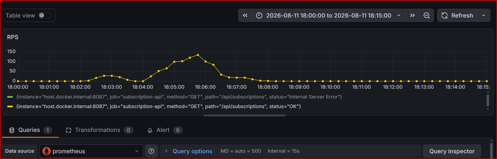
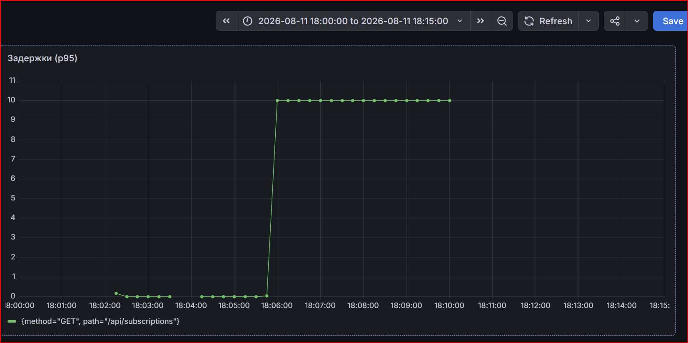
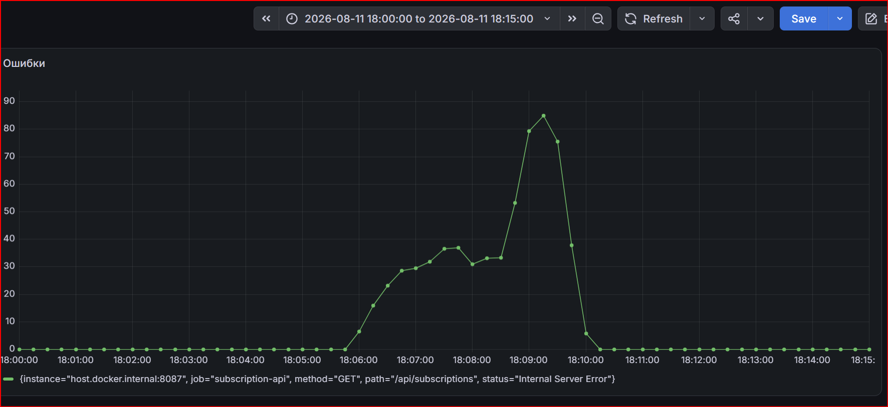

# Rest User Agregator

[](https://github.com/Evgeny-08-01/Rest-user-agregator/actions)

**📄 Техническое задание:** [Посмотреть ТЗ](./technical_requirements/technical_requirements.txt)

REST API сервис для агрегации данных онлайн подписок пользователей.

## Стек технологий

| №  | Компонент               | Технология                                                     |
|----|-------------------------|----------------------------------------------------------------|
| 1  | Язык                    | Go 1.23                                                        |
| 2  | База данных             | PostgreSQL 15                                                  |
| 3  | API                     | REST, gRPC                                                     |
| 4  | Авторизация             | JWT                                                            |
| 5  | Middleware              | CORS, логирование, авторизация, метрики                        |
| 6  | Контейнеризация         | Docker + Docker Compose                                        |
| 7  | CI/CD                   | GitHub Actions                                                 |
| 8  | Мониторинг              | Prometheus + Grafana                                           |
| 9  | Нагрузочное тестирование| vegeta                                                         |
| 10 | Тестирование            | Юнит-тесты + интеграционные                                    |
| 11 | Документация API        | Swagger                                                        |
| 12 | Архитектура             | Слоистая (Handlers → Service → Repository → БД)                |
| 13 | Внедрение зависимостей  | Через конструкторы                                             |
| 14 | Логирование             | Собственный пакет с уровнями (DEBUG, INFO, WARN, ERROR, FATAL) |
| 15 | Graceful shutdown       | Обработка SIGINT и SIGTERM                                     |
| 16 | Миграции                | SQL-скрипты                                                    |
| 17 | Кеширование             | Redis (планируется)                                            |
| 18 | Фронтенд (демо)         | HTML + CSS + JS (чистый)                                       |
| 19 | Кеширование             | Redis                                                          |
| 20 | Android                 | Kotlin                                                         |
-------------------------------------------------------------------------------------------------

## Функциональность

### Бэкенд (Go)

- **CRUDL операции** с подписками
- **Подсчёт суммарной стоимости** подписок за период с фильтрацией:
  - по ID пользователя
- **Кеширование** (Redis) с версионированием — мгновенная инвалидация
- **gRPC + REST API** (два протокола)
- **Валидация входных данных**:
  - UUID пользователя
  - Дата в формате MM-YYYY
  - Цена подписки ≥ 0
- **Регистрация и авторизация** (JWT)
- **Роли:** пользователь и администратор
- **Защита API** через middleware (JWT, CORS, логирование, метрики)
- **Graceful shutdown** (SIGINT, SIGTERM)
- **Healthcheck** (`/health`)
- **Swagger-документация** (`/swagger/index.html`)
- **Собственный логгер** с уровнями (DEBUG, INFO, WARN, ERROR, FATAL)

### Мониторинг и тестирование

- **Prometheus + Grafana** (метрики RPS, p95, ошибки)
- **Нагрузочное тестирование** (vegeta) с графиками и анализом
- **Юнит-тесты + интеграционные** (покрытие ~65%)

### Фронтенд и мобильное приложение

- **Веб-интерфейс** на чистом JS (HTML + CSS)
- **Android-приложение** на Kotlin (APK для установки)

### CI/CD

- **GitHub Actions**:
  - Юнит- и интеграционные тесты
  - Автоматическая публикация Docker-образа в Docker Hub
- **Docker + Docker Compose** (контейнеризация)

### Логирование

Поддерживаются уровни логирования:
- `DEBUG` — для отладки (не используется в продакшене)
- `INFO` — нормальные события (запуск, остановка, HTTP запросы)
- `WARN` — проблемы, не требующие остановки
- `ERROR` — сбои, требующие внимания
- `FATAL` — критические ошибки, сервер падает

Уровень задаётся переменной `LOG_LEVEL` в `.env`

### Graceful Shutdown

При получении сигналов SIGINT (Ctrl+C) или SIGTERM сервер:
1. Перестаёт принимать новые соединения
2. Завершает обработку текущих запросов
3. Закрывает соединение с БД
4. Завершает работу с кодом 
   - Код 0 — если все запросы успели завершиться.
   - Код 1 — если произошла ошибка при старте или остановке.


### Запуск

### Через Docker Compose (рекомендуется)

```bash
docker-compose up --build 

или 

make run
```
## 🛠️ Управление проектом через Makefile

Для управления проектом используется `Makefile`. Все команды выполняются из корня проекта.

### Основные команды

| Команда      | Описание                                            |
|--------------|-----------------------------------------------------|
| `make help`  | Показать все доступные команды                      |
| `make run`   | Запустить сервер локально (БД и Redis через Docker) |
| `make stop`  | Остановить локальный сервер                         |
| `make build` | Собрать Go-бинарник                                 |
| `make clean` | Очистить артефакты сборки (bin/, coverage/, cache)  |

### Тестирование

| Команда         | Описание                                                |
|-----------------|---------------------------------------------------------|
| `make test-u`   | Юнит-тесты (с моками, без БД) — быстро                  |
| `make test-int` | Интеграционные тесты (с БД, автоматически через Docker) |
| `make test-all` | Сначала юнит, потом интеграционные                      |

### Docker

| Команда                    | Описание                        |
|----------------------------|---------------------------------|
| `make docker-up`           | Запустить все контейнеры        |
| `make docker-down`         | Остановить все контейнеры       |
| `make docker-up-db`        | Запустить только PostgreSQL     |
| `make docker-up-redis`     | Запустить только Redis          |
| `make docker-logs`         | Просмотр логов всех контейнеров |
| `make docker-logs-server`  | Просмотр логов только сервера   |

### Миграции

| Команда                   | Описание                                |
|---------------------------|-----------------------------------------|
| `make migrate-up`         | Применить все миграции                  |
| `make migrate-down`       | Откатить все миграции                   |
| `make migrate-down-users` | Откатить только таблицу `users`         |
| `make migrate-down-subs`  | Откатить только таблицу `subscriptions` |


### Android (мобильное приложение)
```
| Команда              | Описание                                                    |
-------------------------------------------------------------------------------------|
| `make adb-reverse`   | Пробросить порты 8087 и 50051 для отладки на телефоне (USB) |
```

---

### 3. Проверить работу

**REST API:**
```bash
curl http://localhost:8087/health
```
# {"status":"ok"}

gRPC API: (доступен на порту 50051)
grpcurl -plaintext localhost:50051 list

# subscription.SubscriptionService
4. Остановить сервер

make stop

Сервер будет доступен по адресу:

REST: http://localhost:8087

gRPC: localhost:50051


## 📌 Если `grpcurl` не установлен:

```bash
Установить grpcurl
go install github.com/fullstorydev/grpcurl/cmd/grpcurl@latest
```
### Локальный запуск (без Docker)
```
Установите PostgreSQL и создайте базу данных `subscriptions`.
Создайте файл `.env` в корне проекта (скопируйте из `.env.example`):
(Все показанные пароли демонстрационные, но соответствуют настройкам проекта)
⚠️ **Внимание:** Все пароли в этом файле — **демонстрационные**.  
Для продакшена используйте реальные секреты и **не коммитьте `.env`** в репозиторий.
```
```
DB_PATH=postgres://postgres:1771@db:5432/subscriptions?sslmode=disable
SERVER_PORT=8087
POSTGRES_PORT=5432
POSTGRES_PASSWORD=1771
POSTGRES_DB=subscriptions
LOG_LEVEL=debug
LOG_PATH=./logs/app.log
POSTGRES_USER=postgres
JWT_SECRET=112233
REDIS_PORT=6379
REDIS_ADDR=
LOGGER=debug
PPROF_ENABLED=false
GRPC_PORT=50051
```
#### Запустите сервер локально:
```
     make run
```     
#### Или вручную:
```bash
docker-compose up -d db redis
go run cmd/api/main.go cmd/api/init.go cmd/api/servers.go cmd/api/helpers.go
```

### 🌐 API Endpoints

### REST API

| Метод   | Эндпоинт                        | Защита | Описание                                   |
|---------|---------------------------------|--------|--------------------------------------------|
| POST    | `/api/register`                 | ❌ Нет | Регистрация пользователя                   |
| POST    | `/api/login`                    | ❌ Нет | Вход, получение JWT                        |
| POST    | `/api/subscriptions`            | ✅ Да  | Создать подписку                           |
| GET     | `/api/subscriptions`            | ✅ Да  | Список подписок (с пагинацией)             |
| GET     | `/api/subscriptions/{id}`       | ✅ Да  | Получить подписку по ID                    |
| PUT     | `/api/subscriptions/{id}`       | ✅ Да  | Обновить подписку                          |
| DELETE  | `/api/subscriptions/{id}`       | ✅ Да  | Удалить подписку                           |
| GET     | `/api/subscriptions/total-cost` | ✅ Да  | Суммарная стоимость за период              |
| GET     | `/api/templates`                | ✅ Да  | Список всех шаблонов                       |
| GET     | `/api/templates/{id}`           | ✅ Да  | Получить шаблон по ID                      |
| POST    | `/api/admin/templates`          | ✅ Да  | Создать шаблон (только admin)              |
| PUT     | `/api/admin/templates/{id}`     | ✅ Да  | Обновить шаблон (только admin)             |
| DELETE  | `/api/admin/templates/{id}`     | ✅ Да  | Удалить шаблон (только admin)              |
| GET     | `/health`                       | ❌ Нет | Проверка работоспособности (для Docker)    |
| GET     | `/api/config`                   | ❌ Нет | Адрес бэкенда для фронтенда                |
| GET     | `/metrics`                      | ❌ Нет | Метрики для Prometheus                     |
| GET     | `/swagger/*`                    | ❌ Нет | Swagger-документация API                   |

---

### gRPC API

Все методы дублируются через gRPC на порту `50051`.

| Метод                | Описание                       |
|----------------------|--------------------------------|
| `GetSubscriptions`   | Список подписок                |
| `CreateSubscription` | Создать подписку               |
| `GetSubscription`    | Получить подписку по ID        |
| `UpdateSubscription` | Обновить подписку              |
| `DeleteSubscription` | Удалить подписку               |
| `GetTotalCost`       | Суммарная стоимость за период  |
| `ListTemplates`      | Список шаблонов                |
| `GetTemplate`        | Получить шаблон по ID          |
| `CreateTemplate`     | Создать шаблон (только admin)  |
| `UpdateTemplate`     | Обновить шаблон (только admin) |
| `DeleteTemplate`     | Удалить шаблон (только admin)  |


---
## 🔐 Авторизация

Реализована JWT-авторизация с ролями:
- `user` — обычный пользователь
- `admin` — администратор (создаётся только через БД)

**Заголовок для защищённы

### Эндпоинты авторизации

| Метод | Эндпоинт        | Описание                        |
|-------|-----------------|---------------------------------|
| POST  | `/api/register` | Регистрация нового пользователя |
| POST  | `/api/login`    | Вход, получение JWT-токена      |

### Регистрация пользователя
```
curl -X POST http://localhost:8087/api/register \
  -H "Content-Type: application/json" \
  -d '{"email":"user@example.com","password":"123456","role":"user"}'
 ```
###   Регистрация админа (только через БД)
```
docker exec -it subscription-db psql -U postgres -d subscriptions -c "INSERT INTO users (id, email, password_hash, role) VALUES (gen_random_uuid(), 'admin@example.com', '$2a$10$8dXxWmxnKk59pdXdy44l/eb4g1PnaFenHN3B.4lLR4bRy4ZL4xjK.', 'admin') ON CONFLICT (email) DO NOTHING;"
```
Вход (логин)
```
curl -X POST http://localhost:8087/api/login \
  -H "Content-Type: application/json" \
  -d '{"email":"user@example.com","password":"123456"}'
 ``` 
  Ответ:
```  
{
    "token": "eyJhbGciOiJIUzI1NiIs...",
    "email": "user@example.com",
    "role": "user"
}  
```
### 📋 Управление подписками

Заголовок для всех запросов (кроме регистрации и логина):
Authorization: Bearer <jwt_token>
##### Эндпоинты подписок
Метод	Эндпоинт	Описание
```
GET	/api/subscriptions	Получить список подписок
GET	/api/subscriptions/{id}	Получить подписку по ID
POST	/api/subscriptions	Создать подписку
PUT	/api/subscriptions/{id}	Обновить подписку
DELETE	/api/subscriptions/{id}	Удалить подписку
GET	/api/subscriptions/total-cost	Суммарная стоимость за период
```
Получить список всех подписок
```
curl -X GET http://localhost:8087/api/subscriptions \
  -H "Authorization: Bearer <jwt_token>"
```
Получить подписку по ID
```
curl -X GET http://localhost:8087/api/subscriptions/1 \
  -H "Authorization: Bearer <jwt_token>"
```
Создать подписку
```
curl -X POST http://localhost:8087/api/subscriptions \
  -H "Content-Type: application/json" \
  -H "Authorization: Bearer <jwt_token>" \
  -d '{"template_id":1,"start_date":"09-2026","end_date":"12-2026"}'
```
Обновить подписку
```
curl -X PUT http://localhost:8087/api/subscriptions/1 \
  -H "Content-Type: application/json" \
  -H "Authorization: Bearer <jwt_token>" \
  -d '{"start_date":"10-2026","end_date":"12-2026"}'
```
Удалить подписку
```
curl -X DELETE http://localhost:8087/api/subscriptions/1 \
  -H "Authorization: Bearer <jwt_token>"
```
Получить суммарную стоимость за период
```
curl -X GET "http://localhost:8087/api/subscriptions/total-cost?start_date=08-2026&end_date=09-2026" \
  -H "Authorization: Bearer <jwt_token>"
```
### 📋 Управление шаблонами (только для админа)
Заголовок:
Authorization: Bearer <jwt_token>
#### Эндпоинты шаблонов
```
Метод	    Эндпоинт	                    Описание
GET	      /api/templates	              Получить список всех шаблонов
POST	    /api/admin/templates	        Создать шаблон
PUT	      /api/admin/templates/{id}	    Обновить шаблон
DELETE	  /api/admin/templates/{id}	    Удалить шаблон
```
Получить список всех шаблонов
```
curl -X GET http://localhost:8087/api/templates \
  -H "Authorization: Bearer <jwt_token>"
```
Создать шаблон
```
curl -X POST http://localhost:8087/api/admin/templates \
  -H "Content-Type: application/json" \
  -H "Authorization: Bearer <jwt_token>" \
  -d '{"service_name":"Яндекс Плюс","price":400}'
```
Обновить шаблон
```
curl -X PUT http://localhost:8087/api/admin/templates/1 \
  -H "Content-Type: application/json" \
  -H "Authorization: Bearer <jwt_token>" \
  -d '{"service_name":"Яндекс Плюс Премиум","price":500}'
```
Удалить шаблон
```
curl -X DELETE http://localhost:8087/api/admin/templates/1 \
  -H "Authorization: Bearer <jwt_token>"
```
ℹ️ Дополнительные эндпоинты
Метод             	Эндпоинт	        Описание
GET	               /health	          Проверка работоспособности сервера
GET	               /api/config	      Конфигурация для фронтенда
Пример:
```
curl http://localhost:8087/health
{"status":"ok"}
```
 
## 🖥️ Фронтенд

- Интерфейс на чистом JS (HTML + CSS)
- Раздаётся бэкендом через `/css/`, `/js/`, `/`
- Эндпоинт `/api/config` для динамического получения адреса бэкенда
- Включает: регистрацию, логин, CRUDL подписок, фильтры, пагинацию, total-cost
### Функциональность

- ✅ Регистрация и вход (JWT)
- ✅ Список подписок, админ видит все подписки, пользователи только свои
- ✅ Создание, редактирование, удаление подписок
- ✅ Расчёт суммарной стоимости за период, для админа для всех подписчиков
- ✅ Управление шаблонами, создание, удаление(если нет подписок),редактирование(для всех) (только админ)
- ✅ Автоматическое обновление списка
- ✅ Блокировка редактирования даты начала, если она уже наступила

## 📱 Мобильное приложение (Android)

Проект включает **Android-приложение** на Kotlin, которое подключается к Go-бэкенду через REST API.

### Стек Android

| Компонент                  | Технология                     |
|----------------------------|--------------------------------|
| Язык                       | Kotlin                         |
| UI                         | XML + Material Design          |
| Сеть                       | HttpURLConnection + Coroutines |
| Хранение                   | SharedPreferences (JWT)        |
| Минимальная версия Android | API 24 (Android 7.0)           |
| Target SDK                 | 34 (Android 14)                |

### Функциональность

- ✅ Регистрация и вход (JWT)
- ✅ Список подписок, админ видит все подписки, пользователи только свои
- ✅ Создание, редактирование, удаление подписок
- ✅ Расчёт суммарной стоимости за период, для админа для всех подписчиков
- ✅ Управление шаблонами, создание, удаление(если нет подписок),редактирование(для всех) (только админ)
- ✅ Автоматическое обновление списка
- ✅ Блокировка редактирования даты начала, если она уже наступила

---

### Скачать готовый APK

📲 **[Скачать Sub.apk](./mobile/android/Sub.apk)**

---

### Как установить и запустить

> **Важно:** Приложение подключается к серверу по адресу `http://127.0.0.1:8087/api`.  
> Для работы нужен **подключённый по USB телефон** с включённой отладкой.

#### Шаг 1. Подготовка телефона
1. Включи режим разработчика (Developer Options):
   - Зайди в Настройки → О телефоне
   - Нажми 7 раз на «Номер сборки»
2. Включи отладку по USB:
   - Настройки → Для разработчиков → Отладка по USB (включить)
#### Шаг 2. Установи приложение
Подключи телефон по USB и выполни:
adb install mobile/Sub.apk
####  Шаг 3. Настрой сетевой проброс
```
Запусти сервер
docker-compose up -d или
make run (локально)
выполни:
adb reverse tcp:8087 tcp:8087
Запусти приложение
Открой приложение на телефоне и войди.
```
## 🌐 CORS

- **Разработка:** разрешён `http://localhost:8087` (порт из `SERVER_PORT`)
- **Продакшен:** если фронтенд и бэкенд на одном домене — CORS не требуется.  

---

### 📊 Параметры фильтрации для `/api/subscriptions/total-cost`

| Параметр        | Тип    | Описание                 |
|-----------------|--------|--------------------------|
| `start_date`    | string | Дата начала (MM-YYYY)    |
| `end_date`      | string | Дата окончания (MM-YYYY) |

> **Примечание:** `user_id` и `service_name` не передаются — бэкенд сам определяет их по роли пользователя.

---

### 🔍 Healthcheck

GET /health
Ответ:
```
{"status":"ok"}
```
📝 Примеры запросов
1. Создание подписки
POST /api/subscriptions
```
{
    "template_id": 1,
    "start_date": "09-2026",
    "end_date": "12-2026"
}
```
Ответ:
```
 {"id": 1}
```
Примечание: user_id, service_name и price берутся из шаблона и контекста авторизации.

2. Получение суммарной стоимости 
GET /api/subscriptions/total-cost?start_date=01-2025&end_date=12-2025
Ответ:
```
{"total": 1500}
```

## Нагрузочное тестирование

### Инструменты
- **vegeta** — генерация нагрузки
- **Prometheus** — сбор метрик
- **Grafana** — визуализация
- **pprof** — профилирование CPU


### Установка vegeta

Для запуска нагрузочного тестирования потребуется утилита **vegeta**:

**macOS / Linux:**
```bash
brew install vegeta
```

**Windows (Git Bash):**
```bash
curl -L -o vegeta.zip https://github.com/tsenart/vegeta/releases/download/v12.11.1/vegeta_12.11.1_windows_amd64.zip
unzip vegeta.zip
mv vegeta.exe ~/bin/
```

**Проверка установки:**
```bash
vegeta -version
```

### Запуск нагрузочного тестирования
#### Тестируемые эндпоинты

| Эндпоинт                            | Что проверяет                           |
|-------------------------------------|-----------------------------------------|
| `GET /api/subscriptions`            | Список подписок (пагинация, сортировка) |
| `GET /api/subscriptions/total-cost` | Суммарная стоимость (тяжёлый расчёт)    |

Пример команды для GET-запроса:

```bash
echo "GET http://localhost:8087/api/subscriptions" | vegeta attack -duration=30s -rate=50 -header "Authorization: Bearer $TOKEN" | vegeta report
```

### Сценарий тестирования
- Длительность каждого теста: **30 секунд**
- Тестирование проводилось на **локальной машине (Windows 10)** через Docker-контейнер с сервисом
- Использовался **один и тот же JWT-токен** для всех запросов
- Тесты запускались **последовательно**, без перезапуска сервера между ними
- Тестировался эндпоинт: `GET /api/subscriptions/total-cost?user_id={uuid}&start_date=01-2025&end_date=12-2025`
- Один пользователь с **5 подписками** (`a04fc7e5-8e8a-4477-967f-8d941864dc4d`)

### Результаты

---

### 1. `GET /api/subscriptions` — список подписок

#### До оптимизаций (без пула, без индексов)

| RPS | Успешность      | Задержка (p95) |
|-----|-----------------|----------------|
| 200 | 79.43%          | 30 сек         |
| 300 | 10.67%          | 30 сек         |

#### После оптимизаций (пул соединений + индексы)

| RPS  | Успешность | Задержка (p95) | Статус            |
|------|------------|----------------|-------------------|
| 1000 | 100%       | 1.399 с        | Стабильно         |Средняя	Была 376 мс (при 1000 RPS)
| 1200 | 99.49%     | 21 с           | Начинаются ошибки |

**Предел устойчивости:** ~1100 RPS.

---

### 2. `GET /api/subscriptions/total-cost` — суммарная стоимость

**Перед тестом:** в БД создано **50 000 подписок**. У тестируемого пользователя 5 подписок.
**Условия:** пул соединений уже настроен, индексы добавлены. Тестировался **тяжёлый расчёт** с формулой `EXTRACT(MONTH FROM AGE(...))`.

#### С кешем (Redis)

| RPS | Средняя задержка | p95   | Успешность | Статус          |
|-----|------------------|-------|------------|-----------------|
| 150 | 13.5 мс          | 60 мс | 100%       | Стабильно       |
| 200 | 15.8 мс          | 77 мс | 100%       | Стабильно       |
| 300 | 265 мс           | 1.0 с | 100%       | Задержка растёт |
| 400 | 2.6 с            | 4.4 с | 99.97%     | Почти предел    |
| 500 | 18.8 с           | 30 с  | 22.3%      | Падение         |

#### Без кеша (Redis отключён)

| RPS | Средняя задержка | p95    | Успешность | Статус            |
|-----|------------------|--------|------------|-------------------|
| 100 | 181 мс           | 243 мс | 100%       | Стабильно         |
| 150 | 770 мс           | 1.4 с  | 100%       | Задержка растёт   |
| 200 | 807 мс           | 1.8 с  | 100%       | Почти предел      |
| 300 | 1.9 с            | 3.2 с  | 81.7%      | Начинаются ошибки |

---

### Сравнение: кеш vs без кеша

| Нагрузка (RPS) | С кешем  | Без кеша | Ускорение |
|----------------|----------|----------|-----------|
| 150            | 13.5 мс  | 770 мс   | 57x       |
| 200            | 15.8 мс  | 807 мс   | 51x       |
| 300            | 265 мс   | 1.9 с    | 7x        |

| Показатель           | С кешем | Без кеша | Улучшение |
|----------------------|---------|----------|-----------|
| Макс. стабильный RPS | 200–300 | 100      | 2–3x      |
| Точка отказа         | 500 RPS | 300 RPS  | 1.6x      |

---

### Сводная таблица по всем оптимизациям

| Что оптимизировали                | Было          | Стало           | Улучшение |
|-----------------------------------|---------------|-----------------|-----------|
| GET /subscriptions (предел RPS)   | 200 RPS (79%) | 1000 RPS (100%) | 5x        |
| total-cost (задержка при 150 RPS) | 770 мс        | 13.5 мс         | 57x       |
| total-cost (стабильный RPS)       | 100 RPS       | 300 RPS         | 3x        |

---
### Влияние логгера на производительность

В ходе профилирования с помощью `pprof` было выявлено, что кастомный логгер на базе `log.Printf` на уровне `info` потреблял **~15–20% CPU**:

**Оценка:** Кастомный  логгер надо перевести на внутреннее использование slog или переписать код с логером slog или zerolog  , это  может дать прирост RPS на 10-15% относительно оптимизированного кода с кэшем и увеличенного пула соединений, однако точная цифра требует дополнительного замера через `pprof` с новым логгером.

---
### Выводы

- **Кеш увеличивает пропускную способность в 2–3 раза:**
  - Без кеша: стабильно до **100 RPS**.
  - С кешем: стабильно до **200–300 RPS**.
- **Задержки с кешем ниже на порядок:**
  - С кешем: **13–16 мс** (при 150–200 RPS).
  - Без кеша: **180–800 мс** (при 100–200 RPS).
- **Точка отказа:**
  - С кешем — **500 RPS** (22% успешности).
  - Без кеша — **300 RPS** (81% успешности).
- **Рекомендуемый лимит для стабильной работы:**
  - С кешем: **до 300 RPS**.
  - Без кеша: **до 100 RPS**.

### Механизм кеширования

Для обеспечения **100% консистентности** данных использовался **подход с версионированием**:

- Каждому пользователю в БД сопоставлена **версия кеша** (таблица `cache_control_user`).
- При изменении данных (Create/Update/Delete) версия **инкрементится**.
- Ключ в Redis строится с учётом версии:  
  `total:v{version}:{userID}:{serviceName}:{startDate}:{endDate}`
- При инкременте версии **старые ключи перестают читаться** — это обеспечивает мгновенную инвалидацию без удаления данных из Redis.
- Дополнительный **TTL = 5 минут** служит страховкой на случай сбоя инкремента.

Такой подход **снижает вероятность показа невалидных данных до <0.1%** (только при одновременном сбое БД и Redis). В отличие от простого TTL (где окно невалидности составляло до 5 минут), версионирование делает кеш **мгновенно консистентным** после любого изменения.
### Для агрегатора подписок такой подход с версированием, скорее всего, избыточен.

## Мониторинг (Prometheus + Grafana)

### Стек
- **Prometheus** — сбор и хранение метрик
- **Grafana** — визуализация и дашборды

### Доступные дашборды

Доступные дашборды

В Grafana настроен дашборд HTTP Monitoring со следующими панелями:

RPS (запросы в секунду) — количество запросов, обрабатываемых сервером.
Запрос: rate(http_requests_total[1m])

p95 задержка по эндпоинтам — 95-й процентиль времени ответа.
Запрос: histogram_quantile(0.95, sum by(le, method, path) (rate(http_request_duration_seconds_bucket[$__rate_interval])))

Ошибки (4xx, 5xx, Internal Server Error) — количество ошибочных запросов.
Запрос: rate(http_requests_total{status!="OK"}[1m])
### Скриншоты





> 💡 *Скриншоты находятся в папке `screenshots/`*

## Документация Swagger

После запуска сервера документация доступна по адресу:
http://localhost:8087/swagger/index.html

## Тестирование

Проект покрыт двумя типами тестов:

- **Юнит-тесты** (с моками) — не требуют БД, быстрые
- **Интеграционные тесты** (с реальной БД) — запускаются через Docker


# Юнит-тесты (без БД)
make test-u

# Интеграционные тесты (с БД)
make test-int

# Все тесты
make test-all

Проект покрыт юнит- и интеграционными тестами.

**Общее покрытие: ~65%**

| Пакет            | Покрытие |
|------------------|----------|
| `authentication` | 95.9%    |
| `middleware`     | 95.5%    |
| `logger`         | 82.1%    |
| `service`        | 77.7%    |
| `handlers`       | 62.4%    |
| `database`       | 47.6%    |
| `cmd/api`        | 21.4%    |

## Миграции

Миграции применяются автоматически при запуске сервера.

| Файл                                                             | Описание                       |
|------------------------------------------------------------------|--------------------------------|
| `migrations/000001_create_users_table.up.sql`                    | Создание таблицы пользователей |
| `migrations/000001_create_users_table.down.sql`                  | Удаление таблицы пользователей |
| `migrations/000002_create_subscriptions_table.up.sql`            | Создание таблицы подписок      |
| `migrations/000002_create_subscriptions_table.down.sql`          | Удаление таблицы подписок      |
| `migrations/000003_create_cache_control_user_table.up.sql`       | Создание таблицы версий кеша   |
| `migrations/000003_create_cache_control_user_table.down.sql`     | Удаление таблицы версий кеша   |
| `migrations/000004_create_subscription_templates_table.up.sql`   | Создание таблицы шаблонов      |
| `migrations/000004_create_subscription_templates_table.down.sql` | Удаление таблицы шаблонов      |

### Откат миграций


#### Через Makefile
```bash
make migrate-down
```
#### Или напрямую
```bash
go run cmd/api/main.go -down
```
## Структура проекта


## 📁 Структура проекта

```
Rest-user-agregator/
├── .github/
│   └── workflows/
│       └── workflows.yml
├── cmd/
│   └── api/
│       ├── main.go
│       ├── init.go
│       ├── servers.go
│       ├── helpers.go
│       ├── main_integration_test.go
│       └── main_unit_test.go
├── internal/
│   ├── authentication/
│   │   ├── jwt.go
│   │   ├── jwt_test.go
│   │   ├── middleware.go
│   │   └── middleware_test.go
│   ├── cache/
│   │   ├── redis.go
│   │   ├── cache_control.go
│   │   └── interface.go
│   ├── database/
│   │   ├── database.go
│   │   ├── database_CRUDL_func.go
│   │   ├── database_test.go
│   │   ├── migrations.go
│   │   ├── template_repo.go
│   │   ├── user_repo.go
│   │   └── cache_control.go
│   ├── handlers/
│   │   ├── rest/
│   │   │   ├── auth.go
│   │   │   ├── handlers_api.go
│   │   │   ├── handlers_integration_test.go
│   │   │   ├── handlers_unit_test.go
│   │   │   ├── helpers.go
│   │   │   └── template_handlers.go
│   │   └── grpc/
│   │       ├── grpc_api.go
│   │       ├── grpc_api_test.go
│   │       └── helpers.go
│   ├── metrics/
│   │   └── metrics.go
│   ├── middleware/
│   │   ├── cors.go
│   │   ├── metrics.go
│   │   └── middleware_test.go
│   ├── models/
│   │   ├── subscriptions.go
│   │   ├── template.go
│   │   └── user.go
│   ├── repository/
│   │   ├── interface.go
│   │   └── mock.go
│   ├── service/
│   │   ├── auth_service.go
│   │   ├── auth_service_test.go
│   │   ├── subscription_service.go
│   │   ├── subscription_service_test.go
│   │   └── template_service.go
│   └── testutils/
│       └── checks.go
├── migrations/
│   ├── 000001_create_users_table.up.sql
│   ├── 000001_create_users_table.down.sql
│   ├── 000002_create_subscriptions_table.up.sql
│   ├── 000002_create_subscriptions_table.down.sql
│   ├── 000003_create_cache_control_user_table.up.sql
│   ├── 000003_create_cache_control_user_table.down.sql
│   ├── 000004_create_subscription_templates_table.up.sql
│   └── 000004_create_subscription_templates_table.down.sql
├── proto/
│   ├── subscription.proto
│   ├── subscription.pb.go
│   └── subscription_grpc.pb.go
├── web/
│   ├── css/
│   │   └── style.css
│   ├── js/
│   │   ├── api.js
│   │   ├── app.js
│   │   ├── auth.js
│   │   ├── components.js
│   │   ├── templates.js
│   │   └── utils.js
│   ├── index.html
│   └── templates.html
├── docs/
│   ├── docs.go
│   ├── swagger.json
│   └── swagger.yaml
├── screenshots/
│   ├── grafana_errors.png
│   ├── grafana_p95.png
│   └── grafana_rps.png
├── technical_requirements/
│   └── technical_requirements.txt
├── pkg/
│   └── logger/
│       ├── logger.go
│       └── logger_test.go
├── compose.yaml
├── Makefile
├── Dockerfile
├── prometheus.yml
├── buf.gen.yaml
├── buf.yaml
├── .golangci.yml
├── .env
├── .gitignore
├── .dockerignore
├── go.mod
├── go.sum
└── README.md
```

## 🔧 Переменные окружения

Все переменные окружения задаются в файле `.env` при локальном запуске.

**В этом проекте используются демонстрационные  пароли**

При необходимости вы можете изменить значения в `.env` под свои нужды.

| Переменная          | Описание                 | Значение по умолчанию                                            |
|---------------------|--------------------------|------------------------------------------------------------------|
| `DB_PATH`           | Подключение к PostgreSQL | `postgres://postgres:1771@db:5432/subscriptions?sslmode=disable` |
| `SERVER_PORT`       | Порт REST API            | `8087`                                                           |
| `GRPC_PORT`         | Порт gRPC                | `50051`                                                          |
| `POSTGRES_PORT`     | Порт PostgreSQL          | `5432`                                                           |
| `POSTGRES_USER`     | Пользователь PostgreSQL  | `postgres`                                                       |
| `POSTGRES_PASSWORD` | Пароль PostgreSQL        | `1771`                                                           |
| `POSTGRES_DB`       | Имя базы данных          | `subscriptions`                                                  |
| `LOG_LEVEL`         | Уровень логирования      | `debug`                                                          |
| `LOG_PATH`          | Путь к файлу логов       | `./logs/app.log`                                                 |
| `LOGGER`            | Тип логгера              | `debug`                                                          |
| `JWT_SECRET`        | Секрет для подписи JWT   | `112233`                                                         |
| `REDIS_ADDR`        | Адрес Redis              | (пусто — используется `localhost:6379`)                          |
| `REDIS_PORT`        | Порт Redis               | `6379`                                                           |
| `PPROF_ENABLED`     | Включить pprof           | `false`                                                          |


## Архитектура

Проект построен на принципах **чистой архитектуры** и разделён на 5 слоёв:
```
| Слой                               | Папка                         |Ответственность                                              |
|------------------------------------|---------------------------------------------------------------------------------------------|
| **1. Презентационный слой (HTTP)** | `internal/handlers/rest/`     | REST: парсинг JSON, валидация, вызов сервиса, HTTP-ответ    |
| **1. Презентационный слой (gRPC)** | `internal/handlers/grpc/`     | gRPC: обработка gRPC-запросов, вызов сервиса, gRPC-ответ    |
|----------------------------------------------------------------------------------------------------------------------------------|
| **2. Бизнес-слой (Service)**       | `internal/service/`           | Содержит логику: парсинг дат, валидацию, расчёты            |
| **3. Интерфейс репозитория**       | `internal/repository/`        | Определяет контракт  с БД (позволяет подменять реализацию)  |
| **4. Слой данных (Repository)**    | `internal/database/`          | Реализует интерфейс, выполняет SQL-запросы                  |
| **5. База данных**                 |  PostgreSQL                   | Хранит  данные                                              |
```
**Цепочка вызовов (на примере REST):**

```text
HTTP-запрос
    ↓
handlers/rest (парсинг JSON, валидация)
    ↓
service (бизнес-логика)
    ↓
repository (интерфейс)
    ↓
database (SQL-запросы)
    ↓
PostgreSQL (хранилище)
```

Принципы, соблюдённые в проекте:

- Инкапсуляция — БД приватная (db), доступ только через методы
- Интерфейсы — SubscriptionRepository отделяет бизнес-логику от работы с БД
- Внедрение зависимостей — хендлеры и сервис получают зависимости через конструкторы
- Слабая связность — легко подменить реализацию БД или мокировать в тестах

## Возможные ошибки и их решение

| Ошибка                                                  | Решение                                                                  |
|---------------------------------------------------------|--------------------------------------------------------------------------|
| `user_id` must always be a valid UUID                   | Проверьте, что переданный user_id соответствует формату UUID             |
| `start_date` must be in format MM-YYYY                  | Используйте формат: месяц (01-12) и год (1900-2100) через дефис          |
| `price` must not be negative                            | Цена подписки должна быть ≥ 0                                            |
| `cannot change start_date that is today or in the past` | Выберите дату позже сегодняшнего дня                                     |
| `subscription with this template already exists`        | Удалите существующую подписку с этим шаблоном или выберите другой        |
| `template_id is required`                               | Передайте `template_id` в запросе                                        |
| `invalid token`                                         | Проверьте, что токен передан в заголовке `Authorization: Bearer <token>` |
| `Database error`                                        | Проверьте подключение к PostgreSQL и выполнение миграций                 |

## CI/CD (GitHub Actions)

Проект использует GitHub Actions для автоматического тестирования, проверки качества кода и публикации Docker-образов.

### Workflow

Пайплайн состоит из двух последовательных джобов:

| Джоб          | Описание                                 | Условие запуска                               |
|---------------|------------------------------------------|-----------------------------------------------|
| Test          | Сборка и запуск тестов с PostgreSQL      | После Push / Pull Request                     |
| Publish       | Публикация Docker-образа в Docker Hub    |Только при создании тега `v*` и                |
                |                                          | успешном прохождении всех предыдущих джобов   |
### Триггеры запуска

| Триггер                        | Что запускается                                 |
|--------------------------------|-------------------------------------------------|
| **Push** в любую ветку         |  Тесты                                          |
| **Pull Request** в любую ветку |  Тесты                                          |
| **Создание тега `v*`**         |  Тесты + Публикация Docker-образа               |


#### Секреты для GitHub Actions
Для публикации в Docker Hub в настройках репозитория должны быть установлены следующие секреты:

Секрет	Описание
DOCKER_USERNAME	Имя пользователя Docker Hub
DOCKER_ACCESS_TOKEN	Токен доступа к Docker Hub

